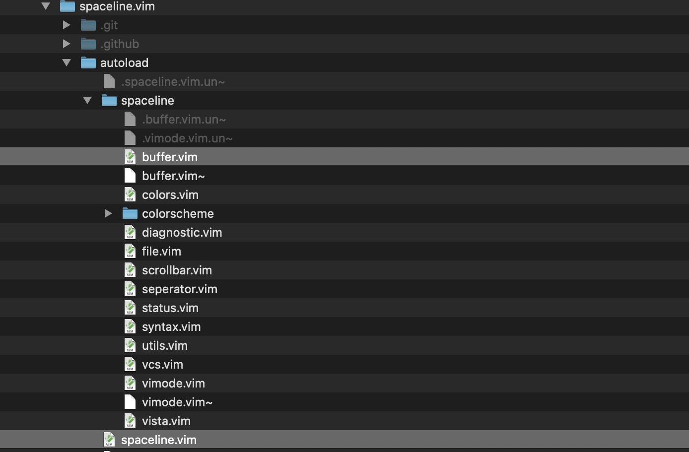
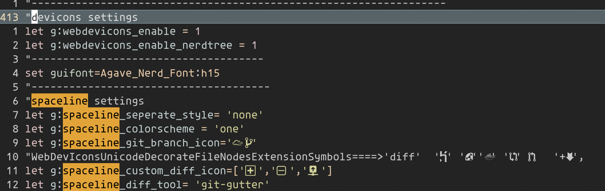
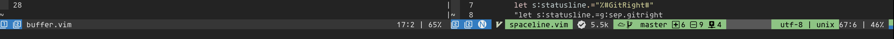
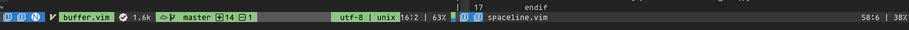
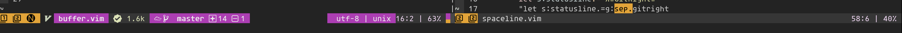
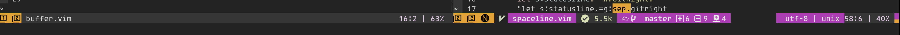
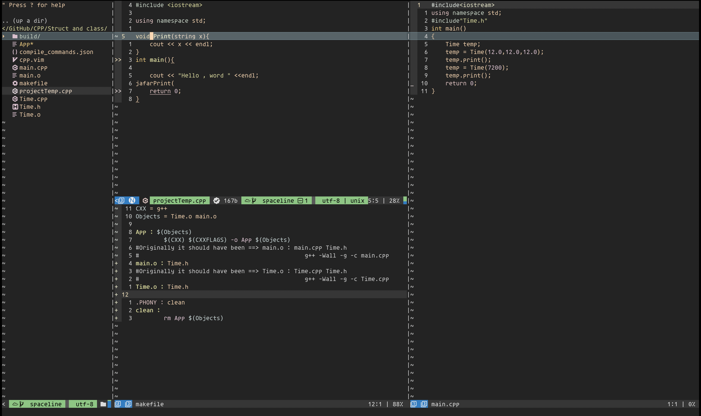

## Table of contents
* [General info](#general-info)
* [Setup](#setup)
* [Options and Icons](#options-and-icons)
* [Color Scheme Samples](#color-scheme-samples)

## General info
Vim Statusline Plugin : Spaceline modified

This Plugin is written by https://github.com/glepnir. 
I changed it a bit so it suits my needs. I am sharing it here so everyone can use it if they want.

## Setup
Follow instructions given in : https://github.com/glepnir/spaceline.vim

Download or clone modified files.

Then go to your plugin and replace  the files highlighted in the picture in your plugin:

These 2 files are the only ones that I have changed.

## Options and Icons
These are the settings that I have in my .vimrc:


So what is different with the original ? 
I have disabled seperate style. So this will not work :
```
let g:spaceline_seperate_style= 'arrow'
```
I have added total number of buffers to statusline. It was really important to me and what started the chane in the first place. 
You need to setup your own icons in the statusline in .vimrc like mine.You can use the below command in your vim to see icons or glyphs that devicons has and
copy the icons to your .vimrc.
```
:echo WebDevIconsUnicodeDecorateFileNodesExtensionSymbols
```
Another options is to use this website: https://www.nerdfonts.com/cheat-sheet. 
Copy the icons that you want and paste them into your setup.

## Color Scheme Samples
You have 3 options for your colorscheme : 'one' , 'space' and 'dracula'. For some reason dracula is not mentioned in the original plugin. It is the only reason I added this part to readme.
Enjoy!  

This is the end result :
One



Dracula


Space



Maybe a weird project would look like this :



