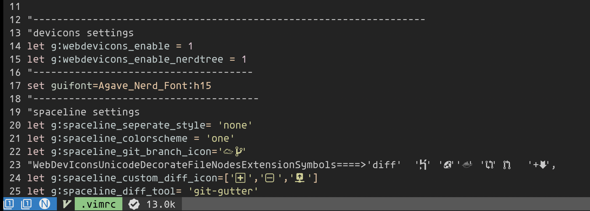
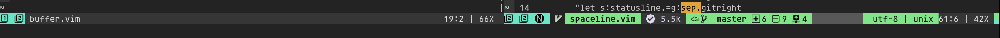
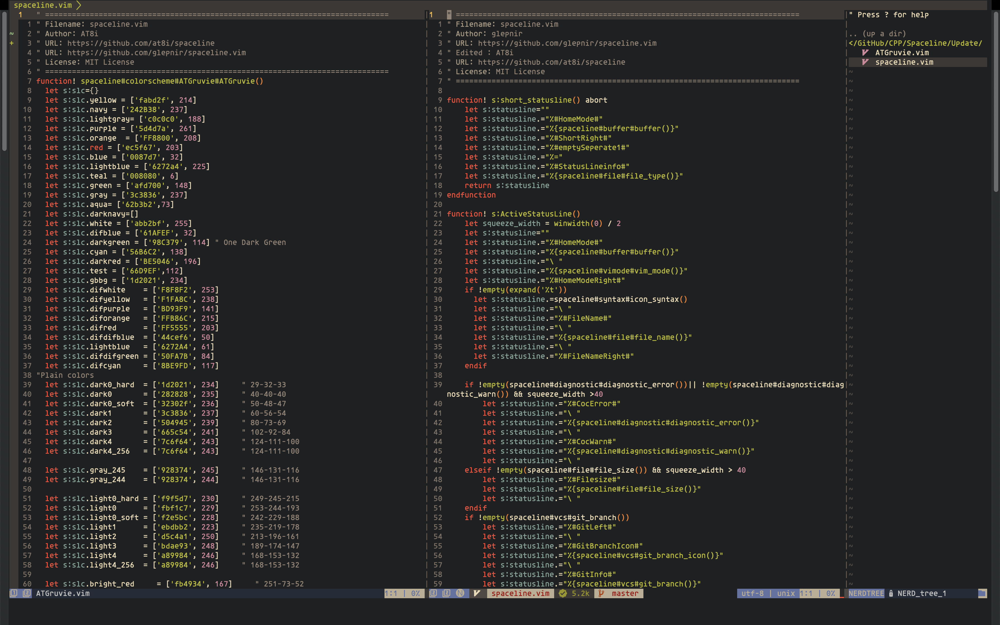

## Table of contents
* [General info](#general-info)
* [Setup](#setup)
* [Options and Icons](#options-and-icons)
* [Color Scheme Samples](#color-scheme-samples)
* [Macos term](#macos-term)
* [New colorscheme](#new-colorscheme)
* [Issues](#issues)

## General info
Vim Statusline Plugin : Spaceline modified

This Plugin is written by https://github.com/glepnir. 
I changed it a bit so it suits my needs. I am sharing it here so everyone can use it if they want.

## Setup
Follow instructions given in : https://github.com/glepnir/spaceline.vim

Download or clone modified files.

Then go to your plugin and replace  the files highlighted in the picture in your plugin:

These 2 files are the only ones that I have changed.

## Options and Icons
These are the settings that I have in my .vimrc:


So what is different with the original ? 
I have disabled seperate style. So this will not work :
```
let g:spaceline_seperate_style= 'arrow'
```
I have added total number of buffers to statusline. It was really important to me and what started the change in the first place. 
You need to setup your own icons in the statusline in .vimrc like mine.You can use the below command in your vim to see icons or glyphs that devicons has and
copy the icons to your .vimrc.
```
:echo WebDevIconsUnicodeDecorateFileNodesExtensionSymbols
```
Another option is to use this website: https://www.nerdfonts.com/cheat-sheet. 
Copy the icons that you want and paste them into your setup.

## Color Scheme Samples
You have 4 options for your colorscheme : 'one' , 'space' and 'dracula' and 'ATGruvie'. See the new colorscheme section to see how you can set it up.
Enjoy!  

This is the end result :

One


Dracula


Space


Maybe a weird project would look like this :


## Macos term
So What is this part about ?

After creating this, I sent it to one of friends and he said that there is something wrong with my Gruvbox setup in iTerm2 and I was like "yeah, I am moving to Mac and this is their version right?"

So after checking here and there, I tried it on Macvim and it turned out that iTerm2 is not working properly with gruvbox(I tried the solution suggested on gruvbox github). I changed it on Mac's original terminal with much better results but the deviocns were not shown properly even after using nerd fonts but after changing the settings shown in pictures below, I was able to
get a good result.


## New colorscheme
There is a new colorscheme available named: ATGruvie inspired by gruvbox dark mode. I wanted it to be really easy on the eyes and this colorscheme was what I was satisfied with. I would recommend using the new spaceline.vim file over the first version.

Add and replace the files available in update folder with files shown in picture.


Add this to your .vimrc if you want to use ATGruvie.

```
let g:spaceline_colorscheme = 'ATGruvie'
```
How it looks:

Terminal Vim:


MacVim:


How it should look at the end:

Vim Terminal


MacVim



## Issues

There are two issues that I have with this. Take a look at these pictures and you will notice them. 

VimTerm


MacVim


1-Terminal: The space after branch of git is bothering me.I did not do anything about it because if messes up MacVim but Solved it for myslef. I guess it is just an if statement but I did not bother.

2-The color of filetype sign is not loading in MacVim.

Terminal is much more important for me so I am ok with this but I am looking for a solution if somebody knows for problem 2. I just usually use MacVim to check a file and go back to my terminal.


